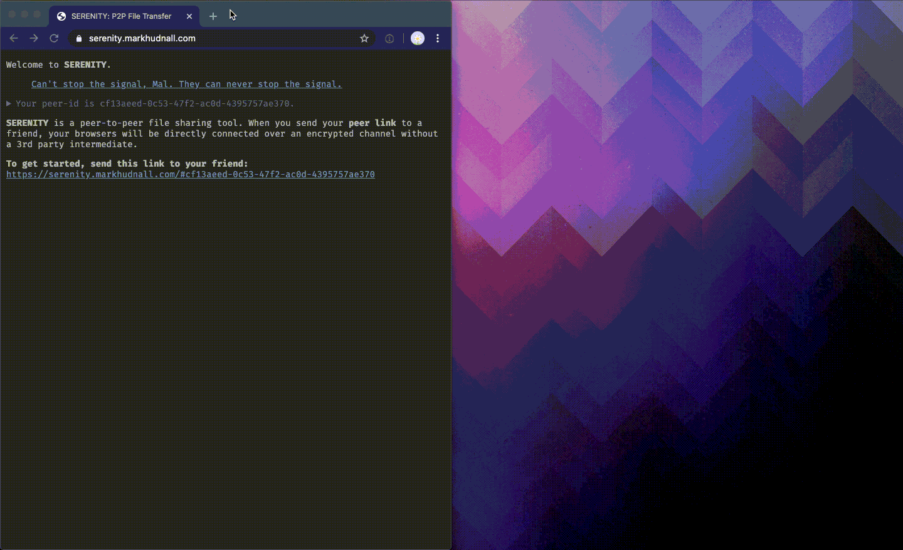

# SERENITY

> P2P file transfer over WebRTC.

Serenity is peer-to-peer file transfer in the browser. Using [WebRTC](https://webrtc.org/), two browsers are directly connected, allowing 
private, encrypted file transfer without an intermediary.

Serenity is available at [serenity.markhudnall.com](https://serenity.markhudnall.com).

## Usage

When you visit Serenity, you'll be connected to a [signaling server](https://www.html5rocks.com/en/tutorials/webrtc/infrastructure/#what-is-signaling) 
and receive a peer link. Send this peer link to a friend. When they visit the link, you'll be connected to each other over WebRTC. Once you're 
connected, you can drag and drop files into the browser window to share them.

Serenity supports arbitrary file sizes and avoids buffering them in memory by using [StreamSaver](https://github.com/jimmywarting/StreamSaver.js). 
In practice, I've used Serenity to transfer files up to 4gb.

A number of other commands are also available by typing `help` into the browser window. For example, you can print the status of the WebRTC 
connection by typing `status`.
